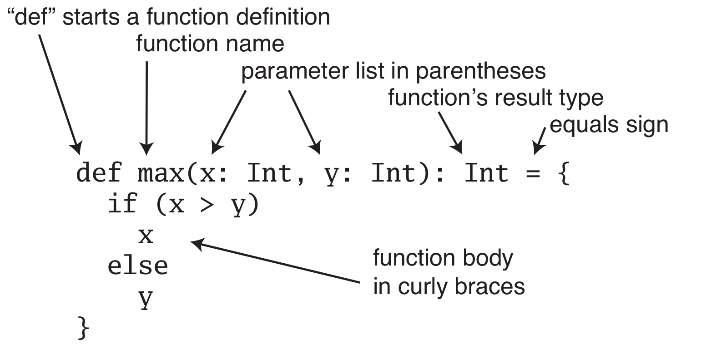

# Intro to Scala  #

We will go through several labs to show the fundamentals of Scala.

Prerequisites:

* Docker
  * [docker pull sakethkollu/intro_to_scala:latest](https://hub.docker.com/repository/docker/sakethkollu/intro_to_scala "My Docker Repo!") (340 MB) (ubuntu)
  * alternatively use the [alpine image](https://hub.docker.com/r/sakethkollu/alpine_scala "200 MB!!!") (200 MB) (BETA)
  * or use `make getImage`
  * or use `make getImageAlpine`
* IDE to edit files:
  * [MS Visual Studio Code](https://code.visualstudio.com/)
    * [Install](https://marketplace.visualstudio.com/items?itemName=scala-lang.scala) the Scala Syntax Plugin for MSVSC
  * [Atom.io](https://atom.io/) - popular opensoure IDE
* [Google Slides](https://docs.google.com/presentation/d/1oYEBllDnbfcchLOz95TcAhi8LXOfKgTdlBl4b9JBgfw/edit?usp=sharing)

Logistics:
* Please work in the directory `todo`
  * This directory is a direct clone of `solutions` except it contains all necessary skeleton code and files as required by the lab
* The Autograder is merely a sanity check and does not cover all edge cases.
* Prepend `sol_` to any make command to run the solution version of the lab. 

### Sources ###

A number of examples have been taken from the following sources:
* http://twitter.github.io/scala_school/basics.html
* Programming in Scala by Odersky and Venners

## Lab 0.5 - Setup ##

1. Make sure docker is installed
2. Pull docker image using:
    ```bash
    make getImage
    #or use
    docker pull sakethkollu/intro_to_scala:latest
    ```
3. Clone or pull the latest `hackathon` repo and run all commands unless otherwise specified in the `hackathon\introToScala` directory.
4. Start the docker image with:
   ```bash
   #Make sure to run this in your hackathon\introToScala directory since -v ${PWD} mounts the present working directory as a volume in the container
   docker run --rm -it --privileged -v ${PWD}:/introToScala sakethkollu/intro_to_scala
   
   #or use

   make startContainer

   #or use

   make startContainerAlpine #for the Alpine image
   ```
5. cd into the `introToScala` directory from the bash terminal for your docker container and you will see all the files for the lab in there
   ```
   C:\Users\saket\Documents\hackathon\introToScala> docker run --rm -it --privileged -v ${PWD}:/introToScala sakethkollu/intro_to_scala
   root@f82a864f0d0e:/# ls
   bin  boot  dev  etc  home  introToScala  lib  lib64  media  mnt  opt  proc  root  run  sbin  srv  sys  tmp  usr  var
   root@f82a864f0d0e:/# cd introToScala
   root@f82a864f0d0e:/introToScala# ls
   README.md  makefile  solutions  sources  todo
   ```
6. Alternatively just figure out how to install scala on your machine. Debian based OS just need `apt-get install scala` and `apt-get install make`

## Lab 0 - Interpreter and Basics ##

Test if Scala is installed by typing the following in your terminal:

```bash
scala -version
```

Start the Scala interpreter by typing:

```bash
scala
```

### Basic Arithmetic ###

```bash
scala> 1+1
res0: Int = 2
```

Your expression is evaluated according to REPL and the result is stored to a default value of `res0`. Try entering another expression and this time the result will be stored to `res1`. In addition to storing the result, the interpreter will show you what type the result is.

### Values and Variables ###

Values in Scala are **Immutable**:

```bash
scala> val two = 1 + 1
two: Int = 2

scala> two = 2
<console>:12: error: reassignment to val
       two = 2
```

*`val` is like the final keyword in Java*

Variables in Scala are **Mutable**:

```bash
scala> var two = 1 + 1
two: Int = 2

scala> two = 2
two: Int = 2
```

You can assign any type to `var`s and `val`s:

```bash
scala> var name = "Saketh"
name: String = Saketh

scala> var name = "Saketh Kollu"
name: String = Saketh Kollu
```

### Functions ###

#### Create functions with the `def` keyword: #### 

```bash
scala> def addOne(m : Int): Int = m + 1
addOne: (m: Int)Int

scala> val three = addOne(2)
three: Int = 3
````

*Note: Function declaration follows the following format.*



#### Multiline Functions (or anything in general) in the Scala Interpreter ####

*Hit `enter` after every line. The Scala interpreter won\'t execute the expression unless it is complete.*

```bash
scala> def timesTwo(x: Int): Int = {
     | val i = x + x
     | i
     | }
timesTwo: (x: Int)Int

scala> val four = timesTwo(2)
four: Int = 4
```

*Note: It is common not to use the `return` keyword in functions in Scala. The last line of the function that is executed is returned.*

#### Anonymous Functions ####

These are basically just lambda functions, functions that dont have a name binding associated with it. 

```bash
scala> (i: Int) => i * 2
res2: Int => Int = <function1>

scala> res2(1)
res3: Int = 2
```

### Hello World ###

*Note: work on this in `introToScala/todo/lab0/`*

Open your favorite IDE and create a file called `HelloWorld.scala` and enter the following:

```scala
object HelloWorld extends App {
    println("Hello, world!")
}
```
We are creating a Scala object named `HelloWorld` that will print "Hello, World!"

*Note: Dont worry about the object syntax, we will go over that later*

#### Program Entry Points ####

Having `HelloWorld` extend `App` at a high level tells Scala that the entry point of our program is here and will execute everything in the body of our object.

Alternatively we could write:

```scala
object HelloWorld {
  def main(args: Array[String]): Unit = {
        println("Hello, world!")
  }
}
```
The entry point of the program will be the main method since we have a main method. 

*Note: `Unit` is the keyword for the `Null` entity in Scala. `println` does not actually return anything besides printing to the terminal, so this function technically returns `Unit` which must be specified.*

#### Compilation ####

To compile our Scala object into a `.class` file, we use `scalac`:

*Note: Make sure you are in the `introToScala/todo/lab0` directory.*

```bash
scalac HelloWorld.scala
```

#### Execution ####

Run the file with `scala`

```bash
scala HelloWorld

cat: /release: No such file or directory
Hello, world!
```

#### Using the makefile ####

You can also compile and run using the makefile!

From the `introToScala` directory run the following commands:


```bash
make compileLab0
```

```bash
make runLab0
```

This command does both the above:
```bash
make lab0
```

Use this command to remove all .class files in `introToScala/todo`:
```bash
make clean
```
You should see something like this:
```bash
sakethkollu@sakethsurface:~/Documents/hackathon/introToScala$ make runLab0
scala -cp ./todo/lab0/classes HelloWorld
cat: /release: No such file or directory
Hello, world!
```

*Note: You might see an error like that above, but it just means your Java Home has some weird setup. Ignore it.*

### Control ###

#### If Statements ####

`if` statements follow the same format as Java `if` statements:

```scala
if (Boolean Expression) {
  //If Expression is True
} else {
  //If Expression is False
}
```
#### For Loop ####

Scala `for` loops are a bit different from Java `for` loops. They are most analogous to python `for` loops. 

```scala
for(w <- 0 to 5){
  // Execute once per each w
  println(w)
}
```

The output of the above code is:
```bash
0
1
2
3
4
5
```
*Note: the `to` operation returns an iterator on the first and second arguments inclusive of both end points.*

#### While Loop ####

`while` loops follow the same format as Java `while` loops:

```scala
while (Boolean Expression) {
  //Execute while Expression is True
}
```

#### Case Statements and Pattern Matching ####

Match on a value, returns the content after the `=>`:

```scala
val times = 1

times match {
  case 1 => "one"
  case 2 => "two"
  case _ => "some other number"
}
```

You can use if statements to create "gaurds":

```scala
times match {
  case i if i == 1 => "one"
  case i if i == 2 => "two"
  case _ => "some other number"
}
```

We capture the value `times` in each of the `i` variables. The `_` case is a wildcard case to prevent runtime error if you do not get any matches. 

You can go even further by specifying a type for the variable to by `match`ed:

```scala
def bigger(o: Any): Any = {
  o match {
    case i: Int if i < 0 => i - 1
    case i: Int => i + 1
    case d: Double if d < 0.0 => d - 0.1
    case d: Double => d + 0.1
    case text: String => text + "s"
  }
}
```

## Lab 1 - Classes and Objects ##

### 1.1 Classes ###

This is how you create a class. Implemented all methods marked TODO and any ____

*Note: work on this in `introToScala/todo/lab1/Car.scala`*

```scala
class Car(name: String){
    
    val owner = name
    
    val make : String = "Toyota"
    val model: String = "Corolla"
    val year: Int = 2020

    val mpg: ____ = 31
    var fuel: Double = 0.0
    var tank: ____ = 13.2
    
    def getOwner(): ____ = {
        owner
    }

    def getMake(): ____ = {
        ____
    }

    //TODO: Implement getModel

    //TODO: Implement getYear

    //TODO: Implement getMPG

    //TODO: Implement getFuel

    //TODO: Implement setFuel(newFuel : Double): Unit
    //Update fuel iff 0 <= newFuel <= tank

    //TODO: Implement getTankCap: Return tank

    //TODO: Implement fillMax(): Unit
    //Set fuel to the tank capacity
  
    //TODO: Implement drive(miles : Double) : Int
    //Return 1 if drove and 0 if not drove
    /* 
        Drive iff:
            a) Remaining fuel is >= 0
            b) miles > 0
        
        Driving should update your fuel level
    
    */ 

}
```

#### Running and Testing ####

From the `introToScala` directory run the following commands:


```bash
make compileLab1_1
```

```bash
make runLab1_1
```

This command does both the above:
```bash
make lab1_1
```

Use this command to remove all .class files in `introToScala/todo`
```bash
make clean
```

### 1.2 Objects ###

Objects are used when you only want a single instance of something. Useful when you want a class factory. 

```scala
object Timer {
  var count = 0

  def currentCount(): Long = {
    count += 1
    count
  }
}
```

Usage:
```bash
scala> Timer.currentCount()
res0: Long = 1
```

Use classes with the same name as an object to create a `companion object` that is often used for factories. 

```scala
class Bar(foo: String)

object Bar {
  def apply(foo: String) = new Bar(foo)
}
```

## Lab 2 - Data Structures ##

### Arrays ###

Preserve order, mutable and can contain duplicates. Access elements zero-indexed using parenthesis instead of square brackets. 

```bash
scala> val numbers = Array(1, 2, 3, 4, 5, 1, 2, 3, 4, 5)
numbers: Array[Int] = Array(1, 2, 3, 4, 5, 1, 2, 3, 4, 5)

scala> numbers(3)
res0: Int = 4

scala> numbers(3) = 10

scala> numbers
res2: Array[Int] = Array(1, 2, 3, 10, 5, 1, 2, 3, 4, 5)
```

*Note: Although `numbers` is a val, which cannot change, it just means `numbers` cannot be reassigned to a new array (even an array containing the same elements as `numbers`. `numbers` however can still have its elements changed.*

### Lists ###

Preserve order, can contain duplicates, however are immutable unlike arrays.

```bash
scala> val numbers = List(1, 2, 3, 4, 5, 1, 2, 3, 4, 5)
numbers: List[Int] = List(1, 2, 3, 4, 5, 1, 2, 3, 4, 5)

scala> numbers(3) = 10
<console>:9: error: value update is not a member of List[Int]
              numbers(3) = 10
```

*Note: The error message says the "value `update`" is not a member of List[Int] which once again shows how Scala is object oriented at the core with the parenthesis acting as an operator that can be used to update (Not in the case of the List class though)*


### Sets ###

Do not preserve order nor do they contain duplicates. They are also immutable. 

```bash
scala> val numbers = Set(1, 2, 3, 4, 5, 1, 2, 3, 4, 5)
numbers: scala.collection.immutable.Set[Int] = Set(5, 1, 2, 3, 4)
```

### Tuple ###

Logical collection of items without using a class or object. They are 1 indexed and accessed by `tuple._#`:

```bash
scala> val hostPort = ("localhost", 80)
hostPort: (String, Int) = (localhost, 80)

scala> hostPort._1
res0: String = localhost

scala> hostPort._2
res1: Int = 80

hostPort match {
  case ("localhost", port) => ...
  case (host, port) => ...
}

#Useful(?) Syntax to make tuples of 2 values using ->

scala> 1 -> 2
res0: (Int, Int) = (1,2)
```

### Maps ###

Works like how you expect it to, mapping one value to another. Note that Maps are essentially composed of tuples by the a -> b syntax above.

```bash
scala> val numbers = Map("one" -> 1, "two" -> 2)
numbers: scala.collection.immutable.Map[java.lang.String,Int] = Map(one -> 1, two -> 2)

scala> numbers.get("two")
res0: Option[Int] = Some(2)

scala> numbers.get("three")
res1: Option[Int] = None
```

*Note: Maps return an option class that is essentially a wrapper container that may or may not hold something. This is in the event where the requested key does not exist. `None` is a subclass of Option that is being returned in the last line above.*

### map ###

Evaluate a function over a list, returning a new list.

```bash
scala> val numbers = List(1, 2, 3, 4)
numbers: List[Int] = List(1, 2, 3, 4)

scala> numbers.map((i: Int) => i * 2) #Note that this is an anonymous function
res0: List[Int] = List(2, 4, 6, 8)

scala> numbers
res1: List[Int] = List(1, 2, 3, 4)
```

### foreach ###

Exactly the same as `map` but it returns nothing. Best for functions that have side-effects like `println`

```bash
scala> val doubled = numbers.foreach((i: Int) => i * 2)
doubled: Unit = ()

scala> doubled

scala> numbers.foreach(println)
1
2
3
4
```

### filter ###

Removes elements that fail to return true on the passed in filter function. Often called a predicate function.

```bash
scala> numbers.filter((i: Int) => i % 2 == 0)
res0: List[Int] = List(2, 4)


scala> def isEven(i: Int): Boolean = i % 2 == 0
isEven: (i: Int)Boolean

scala> numbers.filter(isEven)
res2: List[Int] = List(2, 4)
```

### Practice with Data Structures ###

*Note: work on this in `introToScala/todo/lab2/Lab2.scala`*

```scala
object Lab2 {

    //TODO: Return the nth prime number
    def nthPrime( /* __________ */ ) : Int = {

    }

    //TODO: Find the missing number in the array.
    //First and last numbers are garunteed to exist,
    /*

    scala> val numbers = List(1,2,3,5)
    scala> missing(numbers)
    res0: Int = 4

    */
    def missing( /* __________ */ ) : Int {

    }

}
```

#### Testing ####

Compile:

```bash
make compileLab2
```

Run:

```bash
make runPopulate

make runMissing

make runDuplicates

#run all with:

make runLab2

#Compile and Run

make lab2
```

### FileIO ###

Compute the word count of every word in the data file.

*Note: work on this in `introToScala/todo/lab2/WordCount.scala`*

```scala
import scala.io.Source
import java.io._

//Note: Scala FileIO is just Java FileIO and uses the Java library. It shows how versatile Scala is since it is interoperable with legacy Java code!

class WordCount {

  def wordCount() : Map[String, Int] = {
    val s1 = Source.fromFile("todo/lab2/data.txt").mkString; //returns the file data as String

    //splitting String data with white space
    val str = s1.split("\\s+") //Type is of Array
    println(str) //remove in final code
    
    //TODO: Count the occurences of every word in data.txt

    counts
  }

}
```

#### Testing ####

Compile:

```bash
make compileWordCount
```

Run:

```bash
make runWordCount
```

Compile and Run:

```bash
make wordCount
```

## Lab 3 - Recursion Problems ##

The following are recursion problems that you will solve in scala:

*Note: work on this in `introToScala/todo/lab3/Lab3.scala`*

### GCD Algorithm ###

```scala
    //TODO: Find the greatest common divisor of two Integers
    def gcd( /* __________ */ ) : Int = {

    }
```

### Counting Change ###

```scala
    //TODO: Count the number of ways to make change of an integer quantity using
    //      coins of value 1 and 2 only
    def countingChange( /* __________ */ ) : Int = {

    }
```

### Scala Linked List Usage ###

```scala
scala> import scala.collection.mutable.LinkedList
import scala.collection.mutable.LinkedList

scala> val b = LinkedList(1)
b: scala.collection.mutable.LinkedList[Int] = LinkedList(1)

scala> b.next
res0: scala.collection.mutable.LinkedList[Int] = LinkedList()

scala> print(b)
LinkedList(1)
scala> b.head
res2: Int = 1

scala> b.next = LinkedList(2)
b.next: scala.collection.mutable.LinkedList[Int] = LinkedList(2)

scala> b
res3: scala.collection.mutable.LinkedList[Int] = LinkedList(1, 2)

scala> b.next.next = LinkedList(3)
b.next.next: scala.collection.mutable.LinkedList[Int] = LinkedList(3)

scala> b
res4: scala.collection.mutable.LinkedList[Int] = LinkedList(1, 2, 3)
```

*Note: You might need to import LinkedList using collection.mutable.LinkedList as above. Stick it at the top of Lab3.scala*

[Read More](https://www.scala-lang.org/api/2.12.0/scala/collection/mutable/LinkedList.html)

### Merge Two Sorted Linked Lists ###


```scala
    //TODO: Merge two sorted LinkedLists, returning a new LinkedList
    def mergeLinkedLists( /* __________ */ ) : LinkedList = {

    }
```

### Testing ###

Compile: 

```bash

make compileLab3
```

Run:

```bash
make runGCD

make runCountingChange

make runMergeLL

#Run all

make runLab3

#Compile and Run

make lab3
```

## Next Steps ##

I dont know yet either! Check out the sources listed above!

  
